# Authoring & Run Console — User Guide

A task-oriented guide to the console for analysts and data stewards. No programming
required: everything in this guide happens in the browser, with the mouse and a few
JSON snippets you can copy verbatim.

*This guide covers console and library version 1.5.0. Screenshots are generated from the
committed example files by [`make-screenshots.py`](make-screenshots.py) — if the console
changes, rerun that script and the images regenerate exactly.*

**Contents:**
[1. What this is](#1-what-this-is--when-to-use-it) ·
[2. Getting started](#2-getting-started) ·
[3. Fast path](#3-fast-path-file--verdict-in-three-clicks) ·
[4. Reading results](#4-reading-results) ·
[5. Cleaning messy data](#5-cleaning-messy-data-normalization) ·
[6. Editing the config by hand](#6-editing-the-config-by-hand) ·
[7. Comparing two tables](#7-comparing-two-tables) ·
[8. Iterating](#8-iterating) ·
[9. Power features](#9-power-features) ·
[10. Troubleshooting](#10-troubleshooting) ·
[11. Cheat sheet](#11-cheat-sheet)

The example files used throughout live next to this guide:
[`examples/orders-raw.csv`](examples/orders-raw.csv) (a deliberately messy supplier feed),
[`examples/orders-expected.csv`](examples/orders-expected.csv) (a clean golden copy of the
same orders), and [`examples/orders-config.json`](examples/orders-config.json) (the
finished config this guide builds up to — exported from the console itself).

---

## 1. What this is & when to use it

The console answers three questions about a table you receive or produce, without
installing anything: **Is my feed valid?** (upload it, describe the rules, run
*Validate*); **Is it what the supplier promised?** (write the promise down as a config —
unique ids, ISO dates, no blanks — and the report shows exactly where the feed breaks
it); and **Does what we produced match what was expected?** (upload both tables, turn on
comparison, run *Compare*, and read the diff grid). Everything is read-only: the console
never edits your data, and every judgment on screen comes from the validation and
comparison engines — the console only lays it out.

## 2. Getting started

Open [`console.html`](../console.html) in any browser. Opening it straight from disk
(a `file://` address) works; the only network the page needs is for its two CDN
dependencies (Luxon for date handling, ExcelJS for XLSX files). If someone serves the
folder over http(s) for you, the console is identical but engine runs happen in a
background worker, which keeps the page responsive on large tables — same results either
way.


The window has three fixed zones:

- **Header** — the config library. `Config:` picker, **Save**/**Duplicate**/**Import**/
  **Download** for configs, **Copy section from…**, **undo/redo**, and **Export/Import
  workspace** (chapter 9).
- **Readiness rail** — the four stages: **① Data**, **② Schema**, **③ Comparison**,
  **④ Run & Results**. The badges tell you where you stand: `✓` ready, `⚠` with a count
  (authoring errors, or a stale result), `○` empty or off, `▶ ready` on Run when
  everything is in place. Tabs are freely clickable — the rail *suggests* the
  left-to-right path, it never locks you in.
- **Stage panel** — whatever the selected tab shows.

Two things on a brand-new workspace are normal, not problems: **② Schema ⚠2** counts the
two authoring errors an empty config honestly starts with (no `meta.name`, no columns
yet), and the Data tab points you at the fastest path: *upload a produced table → Infer
draft config → Run Validate (3 steps)*.

> **Try it** — Open `console.html`. Click through the four tabs; nothing is locked.
> Hover the disabled **▶ Validate** button on the Run tab: the tooltip lists the exact
> unmet preconditions, each naming the tab that fixes it.

## 3. Fast path: file → verdict in three clicks

Our supplier sends [`examples/orders-raw.csv`](examples/orders-raw.csv). It is realistic
mess: a report title and a period line *above* the real header, a `TOTAL` row at the
bottom, amounts like ` $ 1,200.50 `, `NA` where values are missing, a duplicated
`order_id`, one date column that mixes `2026-07-15` and `16.07.2026` spellings, and a
`region` column filled in only on the first row of each block.

**Click 1 — upload.** On the Data tab, press **Upload file** in the *Produced table* card
and pick `orders-raw.csv`. The **IngestSpec form** opens. The console suggests `csv` from
the file extension, but *nothing is sniffed* — you confirm the format, header mode,
delimiter, quote and encoding yourself, so the same file always ingests the same way.
Because two junk lines sit above the real header and one totals row sits below the data,
set **skip leading rows** to `2` and **skip footer rows** to `1`:

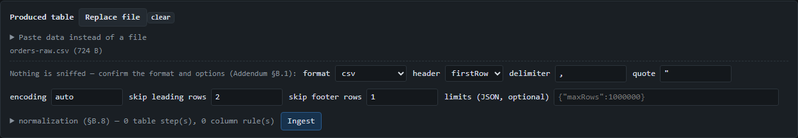

Press **Ingest**. The card replaces the form with a green **provenance line** — the facts
of what was actually read:

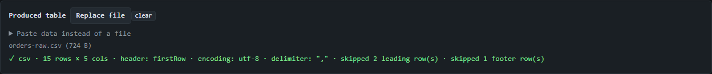

`skipped 2 leading row(s) · skipped 1 footer row(s)` confirms the windowing did what you
asked; 15 data rows and 5 columns remain. (Ingest warnings — merged cells, encoding
fallback and the like — would appear here as a collapsible list; a clean CSV produces
none.)

**Click 2 — infer a draft config.** The **Inference** card below now offers to draft a
config from this data. Press **Infer draft config**. You get an explicit offer — never an
auto-applied one — with per-column evidence:


Read it like an analyst would: `order_id` inferred `int`; `amount` and `order_date`
inferred `string` — honestly, because ` $ 1,200.50 ` is not a number and a column mixing
two date spellings is not (yet) a date; `NA` was observed and adopted into the draft's
null tokens; and *no single-column key candidate* — the duplicated `1005` disqualified
`order_id`. Inference is deliberately conservative: a draft is a suggestion you review,
never authority. Press **Use draft**.

**Click 3 — validate.** Go to **④ Run & Results** and press **▶ Validate**:

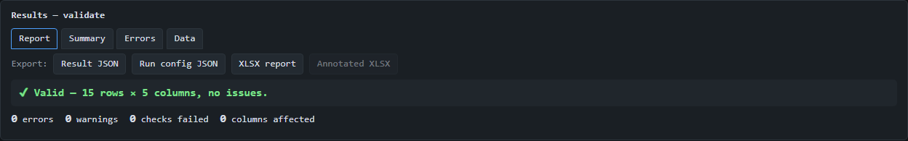

> ✔ Valid — 15 rows × 5 columns, no issues.

A *pass* — and that is the correct reading: the draft describes the data **as it is**
(amounts as text, dates as text, blanks allowed). The feed matches its own shape. The
interesting work starts when you write down what the supplier *promised* — chapter 4
runs exactly that, and chapter 6 shows how to edit the promise in.

> **Try it** — Repeat the three clicks with `examples/orders-raw.csv`. Then, without
> skipping rows, ingest again and look at the inference offer: with the title line as
> the header, every column is a nameless string — a good demonstration of why
> `skipRows` exists and why nothing is guessed for you.

## 4. Reading results

For this chapter the config was tightened to the supplier's actual promise (chapter 6
shows the editing moves): `order_id` must be **unique**, `region` must **not be null**,
and `order_date` must be a **date** in `yyyy-MM-dd` format — with that last rule's
`typeMismatch` set to *warning* severity, because we know the date mess is being fixed
upstream. Before running, look at the Run panel:


The **Outputs** checkboxes drive the engine's *collection flags*, in plain words: some
result views cost memory to produce (the per-cell errors register, the per-cell
observations), so the engine only collects them when asked. In the console you never set
those flags by hand — ticking an output **auto-enables what it needs**, the line under
the checkboxes tells you what was auto-enabled and why, and the saved config is never
modified (the derivation happens on a run-time copy). The same rule, seen from the other
side, is why some export buttons are disabled: in the chapter-3 screenshot the
**Annotated XLSX** button was greyed out because that run collected no observations —
ticking its checkbox and re-running is the fix, and the console tells you exactly that.

Press **▶ Validate**. Now the report has content:


**The report view** is the one-glance answer. The verdict line is one of exactly four:

- `✔ Valid — {rows} rows × {columns} columns, no issues.`
- `⚠ Valid with {n} warning(s) across {n} check(s) — review optional.`
- `✖ Invalid — {n} error(s), {n} warning(s) in {n} column(s). See report.`
- `⛔ Validation aborted ({reason}): {message}` — the run could not meaningfully
  continue (for example, the schema itself was invalid). An abort is still a result you
  read in this same view, not a crash.

**Error vs. warning** is a severity you chose, not a fact about the data: an *error*
makes the verdict `Invalid`; a *warning* alone gives `Valid with warnings`. Here the
date-format findings are warnings because we configured them that way — same finding,
different consequence. *Top issues* lists the worst groups first (at most five).

**The summary view** has one row per finding group — severity, phase, check, column,
message, count, first row, and the most frequent offending values. **The errors view**
is the full register, one row per finding:


Filters combine; row numbers are 1-based on screen (exports keep the same convention).
**Click any row to jump to its cell in the Data view.** Column headers sort
(click again for descending, a third time for the default order).

**The data view** is your table, read-only, tinted:


Because this run collected observations (the Annotated XLSX output was ticked), the
legend offers two tint modes: **register severity** (red = error, amber = warning, plain
= no finding) and the richer **outcome palette** — *violation*, *interpreted* (the
engine read `"1001"` as the number 1001), *effectively null*, *skipped*, *native / not
checked*. It is the on-screen version of the Annotated XLSX export.

**Exports**, on every results view: **Result JSON** (the full engine result), **Run
config JSON** (the exact config this run used — not the possibly-edited current draft),
**XLSX report** (needs the register), **Annotated XLSX** (needs observations), and for
comparisons **Comparison XLSX** (chapter 7). A disabled button always carries its reason.

> **Try it** — Run Validate with only *Errors view* ticked, then tick *Annotated XLSX*
> after the run: nothing errors — the console marks the result stale for that output and
> offers **Re-run** to produce the observations.

## 5. Cleaning messy data (normalization)

Validation never rewrites your data. When the mess itself is the problem — currency
prefixes, regional number formats, blank repeating keys — the sanctioned place to clean
it is the ingestion **normalization pipeline**: an opt-in list of transform steps that
runs between parsing the file and handing the table over. Headers are never touched, and
anything a step cannot parse passes through unchanged, for validation to catch.

Re-upload `orders-raw.csv` (the console asks before replacing the slot — replacing data
makes the previous result stale), set the same skip values, and open **normalization**
in the IngestSpec form. Build this step list — the params are JSON, copy them verbatim:

| Where | Step | Params | What it fixes |
|---|---|---|---|
| table steps | `trim` | *(empty)* | strips the padding in ` $ 1,200.50 ` everywhere |
| column `amount` | `stripAffix` | `{"prefixes":["$"]}` | removes the currency prefix |
| column `amount` | `nullCoerce` | `{"equivalents":["NA"]}` | turns the `NA` amount into a real null |
| column `amount` | `reformatNumber` | `{"format":{"decimalSeparator":".","groupingSeparators":[","]}}` | `1,200.50` → `1200.50` (digits preserved exactly) |
| column `order_date` | `reformatTemporal` | `{"from":["dd.MM.yyyy"],"to":"yyyy-MM-dd"}` | unifies `16.07.2026` to `2026-07-16` |
| column `status` | `nullCoerce` | `{"equivalents":["NA"]}` | real nulls in `status` |
| column `region` | `fillDown` | *(empty)* | blanks inherit the region written above them |


Steps run in order — all table-level steps first, then each column's steps — and the
editor's function picker is generated from the engine's own registry, so what you can
pick is exactly what can run. Press **Ingest** and read the provenance line:

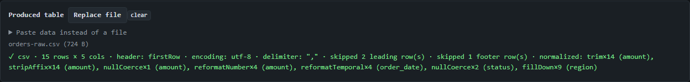

`normalized: trim×14 (amount), stripAffix×14 (amount), …, fillDown×9 (region)` is the
audit trail: per column and function, how many cells actually changed. Nothing silent.

**Raw vs. cleaned is a two-contract story.** Validate the raw feed under the promise
(the *delivery* contract) and the cleaned table under a tightened config re-inferred
from the clean data (the *consumption* contract — `amount` now infers `float` with a drafted two-decimal
`precision` bound, `order_date` infers `date ["yyyy-MM-dd"]`, `region` is non-nullable;
only uniqueness on `order_id` needs adding back by hand). The two verdicts side by side:

| Raw feed, supplier contract | Cleaned table, consumption contract |
|---|---|
|  |  |

Thirteen findings were formatting noise and the pipeline dissolved them. What survives —
`order_id 1005` appearing twice — is a **real data fault**: cleaning fixes how values
are written, never what they are. That is the point of running both contracts.

> **Try it** — After the normalized ingest, open the Δ Delta view on the Run tab (it is
> the default after the re-run): `0 new · 13 resolved · 2 unchanged` — the two
> unchanged entries are the duplicate id, in both runs.

## 6. Editing the config by hand

Everything chapter 4 "tightened" is a few edits on the **② Schema** tab, which is a
master–detail editor over the config:

![The Schema tab: on the left the column list (order_id int, region string, amount string, order_date date, status string) with reorder arrows and the table-settings list (meta, evaluation, nullHandling, structure, resultConfig, compositeKeys, row checks, table checks, resolved preview); on the right the order_date column editor with type date, formats ["yyyy-MM-dd"], nullable false, the per-rule severity table with typeMismatch set to warning, and the green "Authoring validation ✓ valid" panel below.](img/06-schema-tab.png)

The left column lists **columns** (order matters and is draggable via the arrows —
column order is part of the contract) and the **table settings** groups. Every form on
the right is rendered from the engine's own settings catalog (`configModel`): the field
set, defaults shown as placeholders, and which settings apply when. That has two
consequences you can lean on: an **empty field always means "engine default"** (the
placeholder shows what that default is), and settings that currently have no effect are
**dimmed with the reason** rather than hidden — in the screenshot, `nullsEqual` is dimmed
because uniqueness isn't enabled on that column.

**Editing a column.** Select `order_date`:

![The order_date column editor: type.name select set to date, the date settings block with formats ["yyyy-MM-dd"] and a value range, column settings with nullable false and severity {"byRule":{"typeMismatch":"warning"}}, and dimmed irrelevant settings with their reasons.](img/06-column-editor.png)

The type select comes first; the block below it swaps to that type's settings (formats
and value range for a date; regex for a string; precision for a float; allowed values
for a categorical). An **int or float column also carries a `formats` list** — the
NumberFormat array that lets it accept regional spellings, accounting negatives and
spelling contracts; chapter 9 covers it in full, including the **from example** box that
compiles a format from a sample value you type. Constraints — `nullable`, `unique`,
`severity`, `required` — sit under *column settings*.

**Per-rule severity (byRule).** The plain severity select is the column's default; the
*per-rule severity* table underneath overrides individual checks — and it only offers
the rules this column can actually emit:

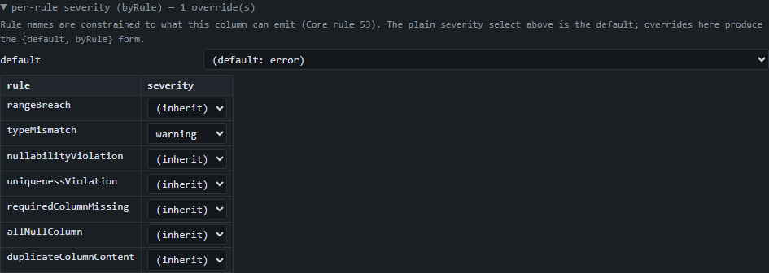

This is how chapter 4 demoted `typeMismatch` on `order_date` to a warning while leaving
everything else an error.

**The live authoring panel** below the editor re-validates the config after every edit.
Make a deliberate mistake — clear the `formats` list on `order_date` — and it answers
immediately:

![The authoring validation panel showing "✖ 1 error(s)" with the entry "✖ columns.order_date.type.formats: expected non-empty array of format strings, got []".](img/06-authoring-error.png)

> ✖ columns.order_date.type.formats: expected non-empty array of format strings, got []

Errors are clickable — the click takes you to the offending field. While an error
exists, Run is blocked (the rail shows the count); fix the field, or press **↶ undo** in
the header — every config edit is undoable (30 steps), and **↷ redo** brings it back.
The panel also shows *advisories* (settings with no effect, with the reason) and
*deferred* badges (rules that can only be checked with a function registry — see
*advanced mode*, chapter 9). Deferred rules are never hidden.

**Saving and moving configs around.** **Save** stores the config in the library
(browser-local storage; the picker in the header switches between saved configs, and a
save in one tab shows up in your other tabs). **Download** writes the config as bare
JSON — exactly what the engine consumes, nothing wrapped around it — and **Import**
takes such a file back in. What you download is byte-for-byte what
[`examples/orders-config.json`](examples/orders-config.json) is: this guide's finished
config, exported from this very screen, and it round-trips — importing it and
downloading it again yields the same document. **Duplicate** copies the active config
under a new name; **Copy section from…** pulls one section (say, a comparison policy)
from another saved config into this one.

> **Try it** — Import `examples/orders-config.json`. The authoring panel validates it on
> the spot; the Comparison tab's toggle is already on, because the file carries a
> `comparison` section — the toggle *is* that fact, not a separate setting.

## 7. Comparing two tables

Validation checks one table against rules. **Comparison** checks the *produced* table
against an *expected* (golden) one, row by row and cell by cell. Continuing from
chapter 5 (cleaned produced table, tightened config), the reference is
[`examples/orders-expected.csv`](examples/orders-expected.csv) — same orders, but the
amount column is titled **`Betrag`**, one amount differs by 0.004, one is genuinely
wrong, and it contains an order (`1015`) the produced feed doesn't have.

On **③ Comparison**, switch on **Comparison enabled**. The toggle literally adds the
`comparison` section to the config (turning it off removes it — after a confirm); the
Data tab grows an *Expected table* slot and Run grows a **Compare** button. Then set the
match policy:

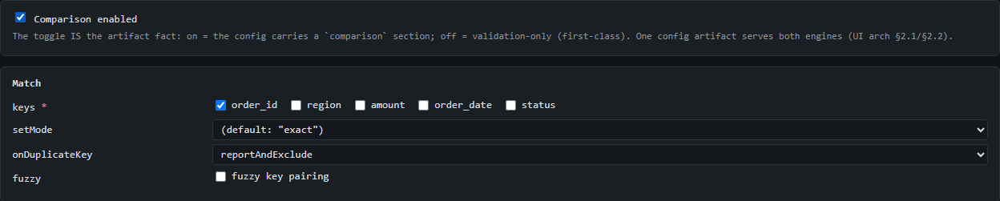

- **Match keys** — how a produced row finds its expected partner. `order_id` is the
  natural key here.
- **onDuplicateKey** in one sentence: when the same key appears twice, `abort` (the
  default) stops the comparison, while `reportAndExclude` reports one `duplicateMatchKey`
  error per duplicated key, sets those rows aside, and compares everything else — the
  right choice here, since we know `1005` is duplicated.

Per-column options live in one table:

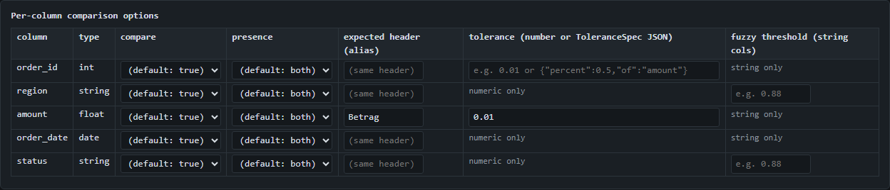

For `amount`, set **expected header (alias)** to `Betrag` — the expected file carries the
column under that name; results keep the logical name `amount` — and **tolerance** to
`0.01`, meaning differences up to a cent are *equivalent*, not wrong. (The other columns
here: `compare` to exclude a column from value comparison, `presence` when a column
legitimately exists on one side only, `fuzzy` for approximate string matching.)

**The tolerance editor** in that cell is a small form with a selector, and a flat `0.01`
is only its simplest shape. The selector offers the four tolerance forms of core
spec §15.8, and the chosen form's own inputs appear beside it:

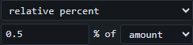

- **absolute (number)** — a fixed ε, the same for every row (`0.01` = one cent).
- **per-row field** — ε is read per row from another numeric column: pick the `field`,
  and `from` chooses whether the driving value comes from the *expected* or the *produced*
  side (default expected). Use it when the acceptable slack is itself data — a
  `priceTolerance` column that travels with each row.
- **relative percent** — ε scales with a value: `percent` × |value(`of`)| / 100, so a
  `0.5%` tolerance on `of: grossWeight` grows with the weight.
- **custom fn** — ε comes from a registered function returning a non-negative number. Like
  any custom check, the console needs the function's code to *run* it: paste it under
  Advanced mode (chapter 9), or run via the API — the config exports fine either way, and
  the cell states the deferral when the function is absent.

Whichever form you pick, the cell passes as a *tolerance match* only when the two sides
actually **differ** but stay inside ε — an exact match is reported as `exact`, never as a
tolerance match (§15.4). The one-click *adopt* button an inference offer shows (the
`tolerance ±0.005 on "amount"` chip of chapter 9) always writes the **absolute** form
into `comparison.fields.<col>.tolerance`; switch to another form here by hand when a
relative or per-row rule fits the data better.

Upload `orders-expected.csv` into the *Expected table* slot, ingest, and press
**▶ Compare**. The verdict reads `✖ Invalid — 3 error(s), 0 warning(s) in 1 column(s)`;
the **Diff** view shows why:


Read the grid with one rule: **the text tells you what happened; the tint tells you how
much you chose to care.**

- `1200.50` (plain value) — the sides are equal; nothing to say.
- `⚠ 340.00 ≈ 340.004` — *equivalent*: different digits, inside your 0.01 tolerance.
  Note it is **untinted**: a tolerance match carries severity *none* by default. The
  fact stays visible; the policy stays quiet.
- `✖ 15.75 ≠ 25.75` — *different*, tinted red: a value mismatch is an error by default.
  (A `[t]` suffix would flag a type-class difference, e.g. text vs. number.)
- The row with match status **missing** is order `1015`: expected, never produced —
  tinted as the `rowMissing` error it is.
- The three **excludedDuplicateKey** rows are the `1005` group (two produced, one
  expected), set aside under `reportAndExclude` with one error for the lot. Their
  values live in the Errors view and the exports.

Hover a diff cell for the measurements (the delta, the tolerance in force, similarity
for fuzzy matches). The severity map on the Comparison tab is where the "how much you
care" side is configured per outcome tier — mapping a tier to *none* silences its
severity, never the fact; the diff always shows every difference.

The **Errors** view gains two comparison-only filter columns, **scope** and **match
status** — the same two dimensions the exported workbook carries:


**Comparison XLSX** in the export bar writes the whole thing as a workbook: a
`Comparison` sheet that renders exactly what the diff grid shows (same text rule, same
tinting), plus the `Errors` sheet with the scope/match-status columns for filtering in
Excel.

> **Try it** — Set the tolerance on `amount` to `0.001` and re-run Compare: the
> `340.004` cell flips from `⚠ ≈` to a tinted `✖ ≠`, and the Δ view (chapter 8) shows
> exactly one new violation.

## 8. Iterating

The loop you will actually live in is: run → adjust one thing → run again. The console
tracks two things to make that loop honest.

**Staleness.** The moment you edit the config or replace data after a run, the result is
marked stale — still fully viewable, but flagged:


Staleness is tracked, never guessed: only a real config edit or data replacement trips
it. **Re-run** repeats the run with the same data and output selections.

**The Δ Delta view.** After a re-run of the same kind, the results panel lands on the
delta by default. Here, the iteration was one setting: uniqueness violations on
`order_id` were demoted from error to warning (a per-rule severity override, chapter 6),
then re-run:

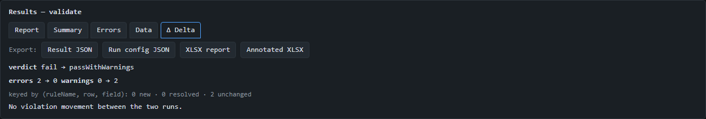

The header gives verdict movement (`fail → passWithWarnings`) and count movement; below,
every violation is keyed by *(check, row, column)* and partitioned into **new**,
**resolved** and **unchanged** — so you see precisely what your change did and nothing
else. (Here: no movement — the same two duplicate-id findings exist, they just weigh
differently now.) Long lists cap at 200 rows with a note; if a run didn't collect the
errors register, the view falls back to grouped count movement and says so. Results and
deltas live in memory only — they never survive a reload, and never need to: they are
one **Re-run** away.

## 9. Power features

Each of these is one small thing, documented in the order you are likely to meet them.

### Paste data instead of files

Every data slot has **Paste data instead of a file**: paste CSV/TSV text, a JSON array
of rows, or a JSON array of records, and the pasted text becomes the ingest source —
same IngestSpec confirmation, same provenance, no file needed. Handy for a quick check
of twenty rows copied out of an email.

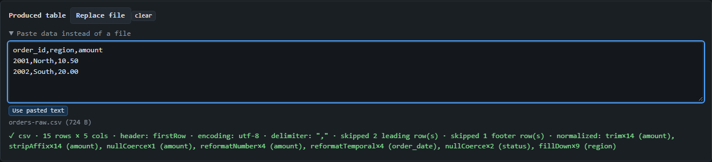

### Inference options — including the mixed-date rescue

The Inference card exposes every inference option: **sampleRows** (how many rows the
evidence is based on — the offer always states `sampled N of M rows`), **suggest
ranges** (draft observed min/max as constraints — off by default because observed
bounds are usually too tight), **suggest precision** (draft the observed decimal-places
bounds on float columns — *on* by default: a money column carrying exactly two decimals
is a real contract, and the drafted `precision` rule catches truncated or over-precise
values later), **seed comparison** (start the `comparison` section from a detected key),
**all accepting formats**, and **exhaustive (all rows)** — evaluate every row instead of
the first thousand, so conclusions (types, nullability, key candidates) are facts of the
whole table rather than of a prefix; slower on very large files, worth it before you
freeze a contract. That last one is the fix for the classic
mixed-date column:

![The inference offer with "all accepting formats" checked: order_date now infers date with formats ["yyyy-MM-dd","dd.MM.yyyy"], confidence ambiguous with reason mixedTemporalFormats, while amount and status remain strings.](img/09-infer-options.png)

Without it, a column mixing `2026-07-15` and `16.07.2026` honestly falls back to
`string` (no single format accepts every value). With it, inference drafts **every**
format the column needs — `["yyyy-MM-dd", "dd.MM.yyyy"]`, most-frequent first — and
labels the column *ambiguous* with the reason `mixedTemporalFormats`, so you know it was
a judgment call. The engine tries formats in order at run time, so both spellings then
validate.

**The same option rescues mixed *number* formats (new in 1.4.0).** A feed where some rows
read `1,234.50` (US) and others `1.234,50` (European) has no single NumberFormat that
accepts all of them, so without the option the column falls back to `string`. With it on,
inference drafts every NumberFormat the column needs — winner (most participants) first,
the rest as ranked alternatives — and labels the column *ambiguous* with the reason
`mixedNumberFormats`, the numeric twin of `mixedTemporalFormats`. One caveat the offer
states plainly: a union-covered numeric column drafts **no `value` range and no
`precision` bound**, even with *suggest ranges* / *suggest precision* on — because a value
can interpret under more than one of the union's formats, the observed min/max and decimal
counts are not stable evidence, and a draft that baked them in could reject its own sample
(Addendum §C.4 point 3). The report still shows the observed extremes; it just doesn't
freeze them into a constraint.

### Reading the offer: confidence and reasons

The offer's **confidence** chip is honesty, not a score: `high` means one type read the
column cleanly with no runner-up; `ambiguous` means the winner rests on a judgment you
should see; `fallback` means the column landed on `string` because nothing else accepted
it. The **reasons** column names *why*, in codes the console prints verbatim — the same
codes you can search this guide for:

- `mixedTemporalFormats` / `mixedNumberFormats` — union coverage (above): several formats
  were needed, so the winner is a judgment call.
- `twoDigitYear` — a `yy` format won; the century is a guess (see *Two-digit years* below).
- `mixedPadding` — a date column mixing **padded and unpadded** spellings of the *same*
  component (`01/02/2026` alongside `1/02/2026` — usually two upstream producers writing into
  one feed). The winner is still correct — the tightest accepting format, e.g. `d/MM/yyyy` — but
  confidence drops to `ambiguous` with **no** ranked alternative: the padded family-mate
  (`dd/MM/yyyy`) doesn't accept the whole sample, so adopting it would be a trap. Contrast a
  consistently *unpadded* column like `{1/01/2026, 22/12/2026}`, which keeps `high` — the
  two-digit `22` is the day's *required* spelling, not padding, so there is no style mixing to
  flag (Addendum §C.4).
- `digitDate` — an 8-digit int column (`20260715`) that also parses as a `yyyyMMdd` date;
  `int` still wins, but the date reading rides along as a ranked alternative.
- `groupingAmbiguity` — every value looks like `1.234`, which reads equally as the decimal
  `1.234` or the grouped integer `1234`. The winner stands, but the opposite reading is
  offered as an alternative — check the report before trusting either.
- `leadingZeroInt` / `unsafeInt` — the column is all digits but converting to a number
  would **lose data**: a leading-zero id (`007` → `7`, and `01`/`1` collapse to one value)
  or a magnitude past the safe-integer range (a 17+-digit number silently loses precision).
  Inference keeps the column `string` and offers the numeric reading as a ranked
  alternative — adopt it only if that loss is intended.
- `numericLike` / `temporalLike` — the two *honesty labels*: the column is `string`
  (nothing structured accepted it), but it *looks* like numbers (`-12.00`, `(3.50)`, `12%`)
  or like dates/times (`9:05`, `15-Jul-2026`). The type is unchanged — the label just tells
  you the fallback wasn't a boring text column, so it may deserve a second look. One is
  visible on the `order_date` row of the chapter-3 offer screenshot.
- `decimalText` *(advisory — the one reason that never changes confidence)*: a `float` column
  that is uniformly money-shaped — every value a dot-decimal string with the **same** number of
  decimals (`12.34`, `5.60`, `100.00`). Unlike the ambiguity reasons above it never demotes a
  column — a `high` column stays `high`, and this is the only reason that ever rides *alongside*
  `high`. It is a nudge, not a doubt: when it fires the report hands you the decimal-scale
  **tolerance** it computes (`0.005` for two decimals) and the spelling **pattern** (`0.00`), so
  you can pin them before summing or comparing — see *Money and decimal precision* below
  (Addendum §C.8).

Two report-only extras never touch the draft. **Suggested tolerances** appear as the
adoption chips above; **suggested patterns** (new in 1.4.0) — a spelling like `#,##0.00`
inferred when every value in an int/float column shares the same decimal-digit count and
grouping — appear only in the offer's downloadable **inference report** (the *Download
report* button, under `suggestions.patterns`), never as a chip and never in the draft: a
pattern is an authorial contract, not observable evidence, so inference proposes it for you
to add by hand (§9's number-formats section), never bakes it in (Addendum §C.7).

**Inference can also conclude `categorical`.** A low-cardinality text column — at least 20
sampled rows, no more than 12 distinct values, and distinct/rows ≤ 0.2 — infers
`categorical` with the observed values drafted as `allowedValues` (a dozen repeated
status codes become an enumerated contract). Below those thresholds the evidence is too
thin and the column stays `string`; the thresholds are fixed by the specification, so the
draft is deterministic (Addendum §C.5). The worked example's `status` column has only 13
rows, so it never trips the floor — a real code column with a few hundred rows does.

### Number formats: regional numbers, negatives, and spelling contracts

An `int` or `float` column carries a **`formats` list** of NumberFormats — the parametric
description of how its numbers are *written*, so the engine can read them without rewriting
the cell (core spec §3.5). Each NumberFormat names the roles of the literal characters:

- `decimalSeparator` and `groupingSeparators` — `{".",[","]}` reads `1,234.50`;
  `{",",["."]}` reads `1.234,50`; `{",",[" "]}` reads `1 234,50`.
- `allowBareDecimal` — accept a number written without its integer part: `.85` reads as
  `0.85`.
- `negativeStyle` — how negatives are spelled. The default `leadingSign` is the plain
  `-12.00`; `parentheses` reads accounting negatives `(1,234.50)`; `trailingMinus` reads
  the SAP-style `1234.50-`. All of them interpret to the canonical `-1234.50`. Under the
  two non-default styles the sign lives **only** in the decoration — a `parentheses` format
  reads `(12.00)` but *rejects* a plain `-12.00`, so a column that mixes `-x` and `(x)`
  needs **two** formats in the array (the engine tries them in order).
- `pattern` — a **spelling contract**: `#,##0.00` demands digit-for-digit grouping and
  exactly two decimals, so `1,234.50` and `234.50` pass while `1234.50` (no grouping) and
  `1,234.5` (one decimal) are rejected. A pattern constrains *lexical shape* only —
  magnitude and scale still belong in the `value` / `precision` ranges.

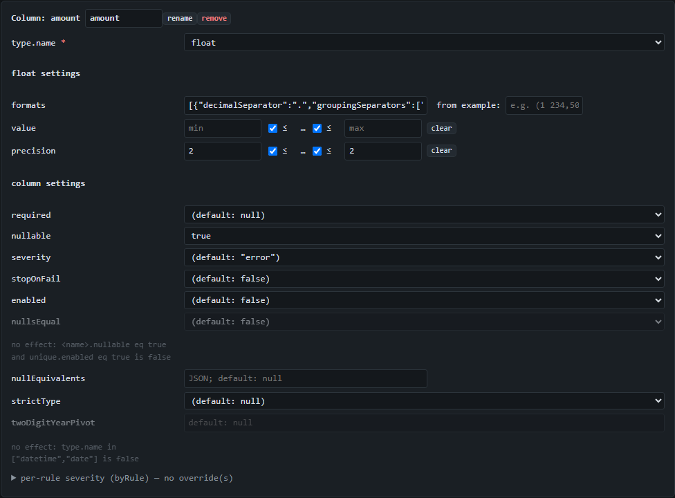

**The one genuinely surprising rule** is what `pattern` does to the rest of the column:
the moment **any** declared format carries a `pattern`, the column **stops accepting plain
spellings**. Normally an int/float column has a direct-parse fallback — `6.16` reads as a
number even if no format matched it. A pattern is an explicit contract ("always exactly
`0.0000`"), and a fallback that quietly admitted `6.16` would defeat it, so the fallback is
**suppressed**: acceptance becomes *exactly* the formats array, nothing more (§3.5). This
is intended and load-bearing — but it means a single pattern-bearing format makes the whole
column strict, so add one only when you truly mean "these are the only acceptable
spellings." (Combining `parentheses` with a pattern therefore also rejects leading-minus
negatives — a hard accounting contract by design.)

**The `from example` box** saves you from writing NumberFormats by hand. Next to the
`formats` field on any int/float column, type a sample value and the console compiles it to
a parametric format and offers it as an append button — you always see the compiled JSON
before it goes in, and nothing is applied silently:

![The amount column editor's formats field with the "from example" box: the typed example "(1 234,50)" has compiled to an append button reading the JSON {"decimalSeparator":",","groupingSeparators":[" "],"negativeStyle":"parentheses"}.](img/09-compiler.png)

Type `(1 234,50)` and it reads the parentheses as `negativeStyle`, the space as grouping
and the comma as the decimal. When an example is genuinely ambiguous — `1.234` is a
decimal *or* a grouped integer — the box offers **both** compiled formats and lets you pick
the intended one, rather than guessing. It only ever *appends*; your existing formats stay.

### Money and decimal precision

For a **text** feed, `float` is a decimal-*text* contract: whether a cell is accepted, and its
`precision`, are decided by counting characters on the value **as written** — no binary64 float
is ever formed to make that call (core spec §6.3, §3.5). That is why `"5.60"` is a two-decimal
value and `"5.6"` a one-decimal value, and the `precision` rule can tell them apart.

Binary64 (the machine `double`) enters the *verdict arithmetic* in exactly **three** places, and
only there can a result differ from exact-decimal truth at the last digit:

- the `value` **range bounds** on a numeric column (the interpreted number is compared against
  the schema's numeric bounds);
- the **`sumEquals`** table check (core spec §7.2);
- **`compare()`**'s equality and tolerance arithmetic (core spec §15.8).

For money feeds that last-cent edge is exactly where rounding bites. The classic bite: ten
`"0.10"` cells summed against a `sumEquals` expecting `1.00` **fail** at the default
`tolerance: 0`, because `0.1` has no exact binary64 and the ten of them accumulate to `0.9999…`.

**The 1.5.0 fix — opt-in, default off** (every existing config behaves byte-for-byte as before):

- **`sumEquals` with `exact: true`** sums decimal-text cells in exact decimal — the ten `"0.10"`
  cells make exactly `1.00` and pass at `tolerance: 0` (core spec §7.2).
- **a comparison column with `exact: true`** — `comparison.fields.<col>.exact` — makes that
  column's equality and tolerance exact-decimal for text-vs-text cells: two decimals that happen
  to collapse onto the same `double` no longer read as equal, and a boundary like `2.13` vs
  `2.03` at tolerance `0.1` lands exactly on the line (core spec §15.8).

Both switches govern **decimal-text** cells only. A **native number** cell — one that arrived
already a number, e.g. ingested from an Excel `.xlsx` — carries no exact text to honor, so it
falls back to binary64 for that pair or row, and the result records which rows fell back. When a
column is uniformly money-shaped, the inference offer flags it with the `decimalText` advisory
(above) and hands you the decimal-scale tolerance and pattern to pin before you turn either
switch on.

### Two-digit years and the century pivot

A two-digit year (`30/06/19`) can't say which century it means. Inference reads `yy`
formats under a fixed **pivot** and always flags the column `ambiguous` with the reason
`twoDigitYear`, because the century is a guess you should confirm. The default pivot is
`1961`, which maps a two-digit year into the window `[1961, 2060]` (so `19` → `2019`,
`85` → `1985`). When that window is wrong — birthdates, vintage records — set
`evaluation.twoDigitYearPivot` on the **② Schema** tab under table settings (e.g. `1900`
maps into `[1900, 1999]`). It also takes a **per-column override**,
`columns.<name>.evaluation.twoDigitYearPivot`, for a table that mixes, say, a birthdate
column (pivot 1900) with an expiry column (default) — a `null` override inherits the table
value (core spec §5.4, §3.4). Inference never *writes* the setting (it drafts under the
default so the schema behaves identically), but the report's interpreted `min`/`max`
already embody the guess, which is why every two-digit-year conclusion goes to you.

### Sub-second timestamps

The `SSSSSS` token accepts a six-digit fractional second, so database timestamps like
`2026-07-15 14:30:45.123456` validate. All six digits are checked lexically; be aware the
**instant** the value carries is only millisecond-resolution under the default engine
(Luxon), so two timestamps differing only past the third fractional digit compare **equal**
as instants — the digits are validated, the sub-millisecond precision is not carried
(core spec §13.3).

### Many files at once (the batch tool)

The console is one table at a time. When you have forty supplier files to profile,
[`batch-infer-standalone.html`](../batch-infer-standalone.html) is the companion tool: pick
many files (or a whole folder — it recurses and filters to the supported extensions), it
infers one draft config per file, and downloads everything as one ZIP (a config and
optional evidence report per file, plus a `manifest.json` that lists every input with its
outcome, failures included) or as one combined **XLSX review workbook** — a sheet per file
with the inferred column metadata above the ingested data. Drafts are still suggestions;
review the interesting ones back in this console. The tool documents itself on its own page
(its whole UI is one screen), so this guide only points at it. Get it from the release
archive of the pinned tag, or copy the single file from the repository — note it **cannot**
be opened from a `cdn.jsdelivr.net` URL directly, because jsDelivr serves HTML as plain
text; the file has to travel to the machine, which is exactly what that single-file build is
for.

### One-click adoption

Some inference findings are suggestions you'd want without replacing your whole config.
The offer renders them as buttons, and each is a **normal config edit against your
active config** — visible in the authoring panel, undoable like any edit: enable
uniqueness on a detected candidate key; add an observed null token (`add "NA" to
nullEquivalents` — visible in the chapter 3 screenshot); adopt a suggested tolerance:

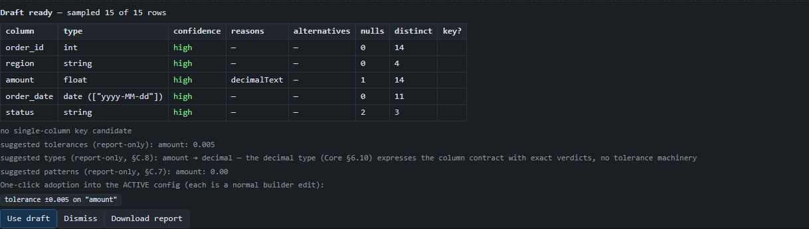

The tolerance suggestion (here ±0.005, from the observed two-decimal precision) is
report-only — a tolerance is a business decision, so it is never drafted, only offered.
The button stays disabled while comparison is off, with the reason.

### Message templates — your wording, everywhere

The Run panel's **messageTemplates** field takes a JSON map from check name to template.
It applies to the run *and* is threaded into every exported workbook, so the wording your
colleagues see in Excel is yours:


Copy-paste to reproduce:

```json
{"uniquenessViolation": "Duplicate order id - every order must appear exactly once"}
```

Placeholders from the check's context work too — e.g.
`{"typeMismatch": "expected {expectedType}, got {actualType} — check the feed"}`.

### Workspace export/import

**Export workspace** (header) writes one JSON bundle: the active config, both IngestSpec
forms (including normalization steps), the data slots' provenance stubs, the requested
outputs, and the pinned referenceInstant — **everything except the table data**, which
is never persisted or exported by the console. Import the bundle (yours, or a
colleague's) and the session resumes at "re-upload the file(s) and press Run":

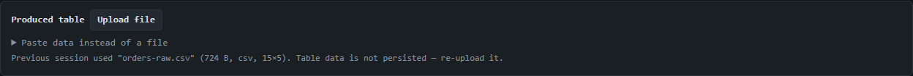

When you re-pick the file, the saved IngestSpec form — skips, normalization steps, all
of it — is reapplied automatically.

### Advanced mode — custom check functions

Configs can reference custom check functions by name. Such a config authors and exports
fine, but the console cannot run it without the function's code — the authoring panel
shows the affected rules as *deferred*, and Run is blocked with the reason (a guaranteed
abort is pre-empted, not discovered). The escape hatch is **Advanced mode** on the Run
tab, and its warning is worth quoting in full:

> Pasted code runs in this page with full access to everything the console can reach.
> Paste only code you trust. Functions live for this session only — they are never
> saved, never exported with configs or workspaces, and advanced mode is off again
> after a reload. Runs that use them execute on the main thread (functions cannot cross
> the worker boundary).

That is the entire security posture, honestly stated: you are pasting executable code
into the page, so the mode is off by default, opt-in per session, and nothing you paste
is ever stored or exported. With the mode on, the pasted names become real: a config
referencing a missing function now gets a genuine authoring error instead of a deferral.

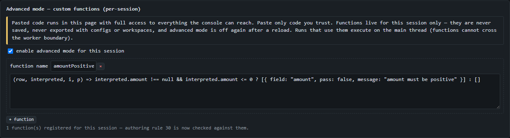

### Pinned referenceInstant

Rules that reference "now" (dates relative to today) normally move with the clock. The
**referenceInstant** field on the Run panel pins "now" to a fixed moment (e.g.
`2026-07-11T00:00:00Z`), so a run reproduces identically tomorrow — for support
sessions, audits, and the screenshots in this guide. It is included in the workspace
bundle. Empty means the real now.

## 10. Troubleshooting

Ingestion failures show a **canonical code** with the message — find it here:

| Code | Meaning | Fix |
|---|---|---|
| `formatMismatch` | the file's bytes are not the declared format | check the format select — nothing is auto-detected |
| `ingestSpecInvalid` | an IngestSpec field is malformed | fix the listed fields (the detail names each one) |
| `sourceUnreadable` | the file could not be read at all | re-select the file |
| `sheetNotFound` | the XLSX sheet name/index does not exist | pick one of the sheet names listed in the error |
| `encodingUnsupported` | the encoding label is not supported | check the encoding field (or use `auto`) |
| `decodingFailed` | the bytes do not match the declared encoding | check the encoding field — explicit encodings never fall back silently |
| `limitExceeded:<limit>` | the source exceeds a configured limit | raise it in the *limits* field — limits fail fast, they never silently truncate |
| `normalizationFunctionError` | a normalization step crashed | the detail names the function, row and column |
| `normalizationFunctionContractViolation` | a step returned a non-scalar | normalization functions must return text, number, boolean or null |

For example, ingesting our CSV with the format forced to `xlsx`:

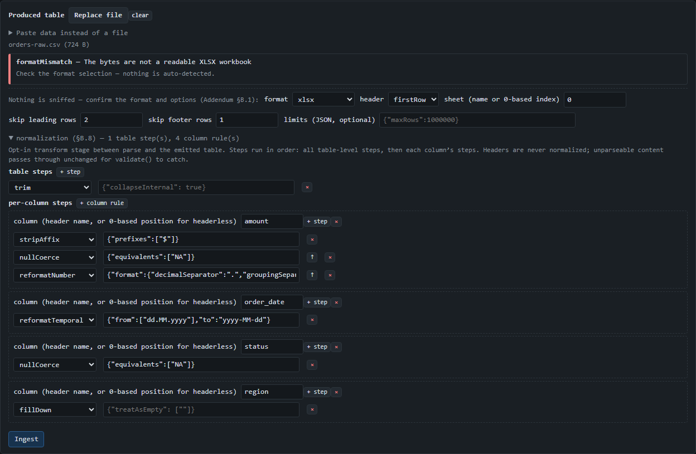

Other situations you may meet:

| Symptom | What it means | Fix |
|---|---|---|
| The page shows only *"TableValidation failed to load"*, or date columns fail with a dependency error | the CDN dependencies (or the engine script) could not be fetched | get network access, or ask for a locally-served copy; the console needs the CDN only for Luxon/ExcelJS |
| Run works but feels slow on a big table opened from disk | on `file://` pages, engine runs happen on the page's own thread (background workers need http(s)) | fine at normal sizes; for very large tables, serve the folder over http |
| **Validate is disabled** | hover it — the tooltip lists the exact unmet preconditions, each naming its tab | most common: authoring errors on ② Schema, or no ingested table on ① Data |
| *"the config references custom functions (deferred: …)"* | the config names check functions the console doesn't have | paste them under Advanced mode (chapter 9), run via the API, or remove the custom checks |
| `messageTemplates is not valid JSON` when running | the template field doesn't parse | fix the JSON (it must be an object of string templates); clear the field to disable |
| *"localStorage is unavailable …"* notice | private-browsing mode or a full quota | the console keeps working for the session; use **Download** / **Export workspace** to keep your work |
| A result view says *"No register collected in this run"* | the run didn't collect what the view needs | tick the corresponding output and **Re-run** — the console never errors on this, it tells you |
| A notice says a column name *"contains '.' or brackets — the per-column editor cannot address such names"* | a header like `price.eur` or `sales[0]` validates fine, but the console addresses columns by dotted path, so its per-column editor can't open one whose own name contains `.`, `[` or `]` | rename the source header, or rename the column on the ② Schema tab (the console blocks those characters in renames), then edit it normally |
| `⛔ … aborted (…)` verdict | the run stopped early (e.g. the config was invalid at run time) | read the abort reason in the Report view; fix the config on ② Schema |

## 11. Cheat sheet

The mess → what to do in the console:

| The mess | Do this | Chapter |
|---|---|---|
| Report title above the header, totals row below | *skip leading rows* / *skip footer rows* in the IngestSpec form | [3](#3-fast-path-file--verdict-in-three-clicks) |
| ` $ 1,200 `, `12 %`, `5kg` | normalization: `stripAffix`, then `reformatNumber` | [5](#5-cleaning-messy-data-normalization) |
| `1.234,50` / `1 234,50` regional numbers | `formats` on the int/float column (accept as-is), or normalization `reformatNumber` (rewrite) | [5](#5-cleaning-messy-data-normalization), [6](#6-editing-the-config-by-hand) |
| `NA`, `N/A`, `-`, empty — the null-token zoo | `nullEquivalents` (inference adopts observed tokens; one-click adoption); normalization `nullCoerce` for real nulls | [3](#3-fast-path-file--verdict-in-three-clicks), [9](#9-power-features) |
| One column, two date spellings | infer with **all accepting formats**, or list several `formats` on the column | [9](#9-power-features), [6](#6-editing-the-config-by-hand) |
| Unpadded dates (`1.7.2026`) or `yyyyMMdd` digit dates | inference handles unpadded day/month (`d.M.yyyy`); 8-digit date-like int columns get a flagged date alternative in the offer | [3](#3-fast-path-file--verdict-in-three-clicks), [9](#9-power-features) |
| One date column mixing padded and unpadded (`01/02/2026` next to `1/02/2026`) | the winner is still the tightest accepting format; the offer flags it **ambiguous** (reason `mixedPadding`) with no alternative — a consistently unpadded column (`22/12/2026`) stays `high` | [9](#9-power-features) |
| Region written once per block, blanks below | normalization `fillDown` on the column | [5](#5-cleaning-messy-data-normalization) |
| Leading-zero ids (`"007"`) | declare the column `string` — an int column would read it as `7` | [6](#6-editing-the-config-by-hand) |
| Word/Excel artifacts (NBSP, curly quotes, long dashes) | normalization `replaceChars` with an exact substitution map | [5](#5-cleaning-messy-data-normalization) |
| Duplicate ids | `unique` on the column — and see the two survivors in chapter 5's clean run | [4](#4-reading-results), [5](#5-cleaning-messy-data-normalization) |
| Duplicate match keys in a comparison | `onDuplicateKey: reportAndExclude` — one error per key group, rows set aside, run continues | [7](#7-comparing-two-tables) |
| The golden file names the column differently | *expected header (alias)* on the column's comparison options | [7](#7-comparing-two-tables) |
| Cent-level rounding differences | *tolerance* on the numeric column (inference suggests one) | [7](#7-comparing-two-tables), [9](#9-power-features) |
| Money sums/compares off by a cent (ten `0.10` cells ≠ `1.00`) | `float` acceptance is lexical, but `sumEquals`/`compare()` do binary64 math; set `exact: true` (new in 1.5.0, opt-in, default off) for exact-decimal sums and comparisons on decimal-text feeds | [9](#9-power-features) |
| Amounts must keep exactly N decimals | *suggest precision* (on by default) drafts the observed bounds | [9](#9-power-features) |
| Decimals without a leading zero (`.85`) | inference drafts a NumberFormat with `allowBareDecimal` — validation reads `.85` as `0.85` | [9](#9-power-features) |
| Accounting negatives (`(1,234.50)`) or SAP trailing minus (`1234.50-`) | inference drafts a NumberFormat with `negativeStyle` — validation reads both as `-1234.50`; a column mixing `-x` and `(x)` takes two formats in the array | [9](#9-power-features) |
| A spelling contract ("always exactly `0.0000`") | add `pattern` to the NumberFormat (digit counts + grouping positions, hard constraint — suppresses the plain-parse fallback), or type an example into the schema editor's **from example** box and accept the compiled format | [9](#9-power-features) |
| Two-digit years (`30/06/19`) | inference drafts `dd/MM/yy`-style formats, always flagged **ambiguous** — the century is a guess (years map into `[pivot, pivot+99]`, default pivot 1961). Wrong century? Set `evaluation.twoDigitYearPivot` (e.g. 1900 for birthdates), per column if needed | [9](#9-power-features) |
| Database timestamps (`…14:30:45.123456`) | `SSSSSS` accepts six-digit fractions (instants carry millisecond resolution) | [9](#9-power-features) |
| `#N/A`, `n/a`, `None`, `--` scattered in cells | recognized null-token candidates since 1.3.0 — adopted into `nullEquivalents` when observed | [9](#9-power-features) |
| Zero-padded ids (`007`) or 17-digit numbers | inferred as **string** (offer reason `leadingZeroInt` / `unsafeInt`) with the numeric reading as a ranked alternative — converting would destroy zeros or precision; adopt the alternative only if that loss is intended | [9](#9-power-features) |
| Every value looks like `1.234` | the winner is flagged ambiguous (offer reason `groupingAmbiguity`) with the other reading (decimal vs thousands) as an alternative — check the report before trusting either | [9](#9-power-features) |
| A feed mixes `1,234.50` and `1.234,50` number spellings | infer with **all accepting formats** — the column drafts a union of NumberFormats (reason `mixedNumberFormats`) and validates both; union columns draft no value/precision | [9](#9-power-features) |
| A dozen repeated codes in a low-cardinality column | inference concludes `categorical` (≥20 rows, ≤12 distinct, ratio ≤0.2) and drafts the observed values as `allowedValues` | [9](#9-power-features) |
| A `string` column that *looks* numeric/temporal but stayed text | the offer's `fallback` confidence plus reason `numericLike` / `temporalLike` flags it for a second look — the type is honest, the label is the hint | [3](#3-fast-path-file--verdict-in-three-clicks), [9](#9-power-features) |
| A header like `price.eur` or `sales[0]` | validates fine, but the per-column editor can't address a dotted/bracketed name — rename the header or the column on the Schema tab | [6](#6-editing-the-config-by-hand), [10](#10-troubleshooting) |
| "What did my change do?" | re-run and read the **Δ Delta** view | [8](#8-iterating) |
| "Why is this button disabled?" | hover it — every disabled control in the console carries its reason | [2](#2-getting-started), [4](#4-reading-results) |

Deeper reading: the [README](../README.md) (library overview and the messy-data
cookbook) and the [console architecture](../table-validation-ui-architecture-v1.5.0.md)
(§11 maps every library capability to its place in the UI) live in this repository; the
[core specification](https://github.com/sergeiosipov/table-validation-spec/blob/v1.5.0/table-validation-core-spec-v1.5.0.md)
(the exact meaning of every check and verdict) lives in the companion
`table-validation-spec` repository.
